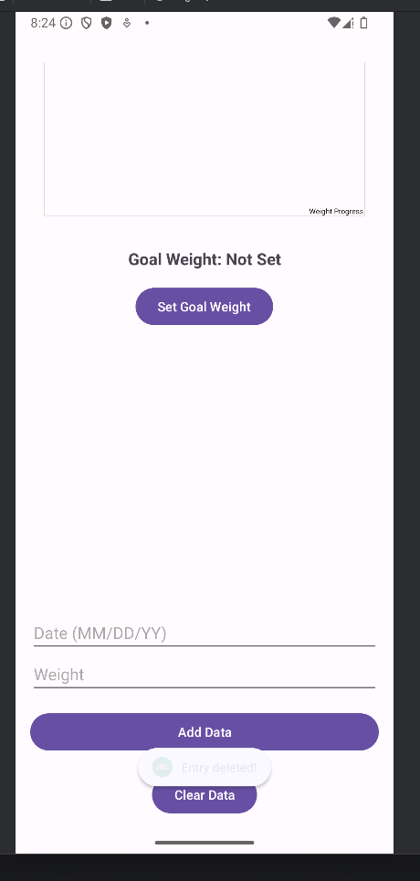
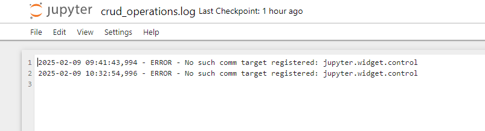
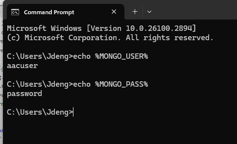

# SNHU CS-499 Capstone Portfolio Webpage Overview

## Overview
The SNHU CS-499 Capstone Portfolio highlights two projects that demonstrate my expertise in software engineering, algorithms, data structures, and database management. Both projects have been enhanced as part of the capstone course to meet professional standards and align with course outcomes.

---

## Projects

### **Nuoro Weight Management App**
The **Nuoro Weight Management App** is an Android-based mobile application designed to help users track their weight, set goals, and analyze progress through data visualization. Originally developed in **CS-360: Mobile Architect & Programming**, it focuses on providing an intuitive user experience for personal weight management.

#### **Original Implementation**
- Basic SQLite storage for weight logs.
- Static text-based weight entry display.
- Simple goal-setting functionality.
- No data validation, sorting, or filtering.
- Limited user interactivity and feedback.

---

### **Grazioso Salvare Dashboard**
The **Grazioso Salvare Dashboard** is a web-based application designed for animal rescue organizations to visualize, filter, and analyze rescue animal data. It uses **MongoDB**, **Dash**, and **Plotly** for interactive data visualization.

#### **Original Implementation**
- **Database Integration**:
  - MongoDB for storing animal rescue data.
  - CRUD operations implemented in the `AnimalShelter` class.
- **Data Visualization**:
  - Interactive dashboard with filters for breed, location, and rescue type.
  - Pie charts and maps dynamically update based on user-defined filters.
- **Limitations**:
  - Lacked proper error handling for CRUD operations.
  - Query performance was slow for larger datasets due to missing indexes.
  - Hardcoded credentials posed security risks.

---

## Enhancements Overview

The enhancements applied to these projects span three major categories: **Software Engineering & Design**, **Algorithms & Data Structures**, and **Databases**. Below is a summary of each enhancement and how it improved the respective projects:

---

## **Enhancement One: Software Engineering & Design**
### **Nuoro Weight Management App**
- **Input Validation**:
  - Ensured valid date format (`MM/DD/YY`) and weight range (`1-500 lbs`).
  - Prevented invalid entries from being stored.
- **Interactive Data Management**:
  - Replaced static text with a `RecyclerView` supporting edit and delete actions.
- **Data Visualization**:
  - Integrated **MPAndroidChart** for dynamic weight trend visualization.
- **Improved SMS Permissions**:
  - Fixed broken request flow, ensuring correct permission handling.
- **User Feedback Enhancements**:
  - Added error messages, confirmation dialogs, and success indicators.
- **Database Enhancements**:
  - Refactored `DatabaseHelper` to support real-time updates.
- **Goal Weight Management**:
  - Displayed goal weight on the graph for easy tracking.

---

## **Enhancement Two: Algorithms & Data Structures**
### **Nuoro Weight Management App**
- **Sorting Options**:
  - Sort by **Date (Ascending/Descending)**.
  - Sort by **Weight (Ascending/Descending)**.
- **Search Functionality**:
  - Filter by **date range** and **weight range**.
- **Optimized Database Queries**:
  - Implemented `ORDER BY` for sorting and `WHERE` filters for searching.
- **Bug Fixes**:
  - Fixed chart disappearing issue when sorting descending.
  - Resolved RecyclerView scrolling issues.

---

## **Enhancement Three: Databases**
### **Grazioso Salvare Dashboard**
- **Error Handling**:
  - Implemented structured exception handling in CRUD methods to improve reliability and debugging.
- **Query Optimization**:
  - Added MongoDB indexes for commonly queried fields, such as `breed` and `location`, to enhance performance.
- **Secure Credential Storage**:
  - Replaced hardcoded credentials with environment variables for improved security.
- **Documentation**:
  - Enhanced inline comments and created a detailed guide for MongoDB queries and operations.
- **Unit Testing**:
  - Developed comprehensive unit tests to validate CRUD operations and ensure database reliability.

---

## Technical Implementation
Each enhancement demonstrates key computer science principles and applies industry best practices to improve software design, user experience, performance, and security.

1. **Nuoro Weight Management App**:
   - Focused on enhancing interactivity, data visualization, and data reliability.
   - Applied robust validation and dynamic UI updates.
2. **Grazioso Salvare Dashboard**:
   - Improved database security, performance, and maintainability.
   - Enhanced query performance and ensured reliable CRUD operations through testing.

---

## How to Run
1. **Nuoro Weight Management App**:
   - Open in **Android Studio**.
   - Run on a compatible emulator or physical Android device.
2. **Grazioso Salvare Dashboard**:
   - Clone the repository and run the Jupyter Notebook.
   - Ensure MongoDB is set up and configured.

---

## **Screenshots**

### **Enhancement One: Software Engineering & Design**
| Login Screen | SMS Permission Request |
|-------------|-----------------------|
|  |  |

| Account Creation | Initial Data Display |
|----------------|---------------------|
|  |  |

| Edit Entry Dialog | Delete Entry Confirmation |
|------------------|-------------------------|
|  |  |

| Goal Weight Entry | Clear All Data Confirmation |
|------------------|---------------------------|
|  |  |

---

### **Enhancement Two: Algorithms & Data Structures**
| Sort by Date (Ascending) | Sort by Date (Descending) |
|--------------------------|--------------------------|
|  |  |

| Sort by Weight (Ascending) | Sort by Weight (Descending) |
|----------------------------|----------------------------|
|  |  |

| Search & List | Input Validation |
|--------------|-----------------|
|  |  |

---

### **Enhancement Three: Databases**
| Dashboard Filtering | Enhanced Dashboard Integration |
|----------------------|------------------------------|
|  |  |

| MongoDB Indexes | Centralized Error Logging |
|-----------------|--------------------------|
|  |  |

| Unit Tests for CRUD | Secure Credential Storage |
|--------------------|---------------------------|
|  |  |

---

## **Technical Implementation**
- **Software Engineering and Design**:
  - Added validation, interactivity (RecyclerView), and visualizations (MPAndroidChart).
- **Algorithms & Data Structures**:
  - Enhanced sorting and filtering for user weight data, optimized query performance.
- **Databases**:
  - Added structured error handling, MongoDB indexing, and secure credential management.

---

## **How to Run**
1. Clone this repository.
2. Open in **Android Studio** for the Nuoro app or **Jupyter Notebook** for the Grazioso Salvare Dashboard.
3. Run the project on a compatible emulator or physical device.

---

## **Acknowledgments**
Developed as part of **CS-360 & CS-499 at SNHU**. Special thanks to course instructors for their guidance.
